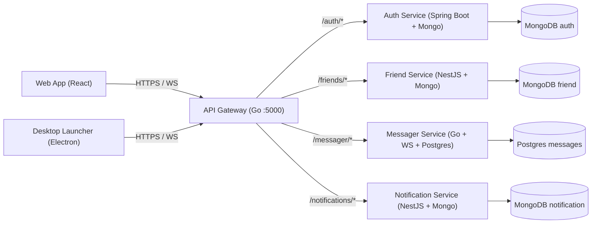

CHAT APP – Distributed Architecture (Zalo‑style)
================================================

This repository hosts a **distributed real‑time chat application**, inspired by Zalo’s architecture.  
The project is split into two submodules:

- `backend/` – microservices: API Gateway, Auth, Friends, Messaging (WebSocket), Notifications
- `frontend/` – React web app (will also be packaged as an **Electron launcher** for a desktop experience)

## High‑level architecture

### Service responsibilities

- **API Gateway (Go)**  
  Central entry point, handles routing, basic cross‑cutting concerns, and WebSocket upgrade towards `messager-services`.

- **Auth Service (Spring Boot, MongoDB, JWT)**  
  Phone‑number based registration & login, password hashing, JWT issuance and validation.

- **Friend Service (NestJS, MongoDB)**  
  Friend graph (requests, accepts, blocks), contact search; designed so that the gateway can expose it as `/friends/...` APIs.

- **Messager Service (Go, Gorilla WebSocket, Postgres)**  
  Persistent WebSocket hub for conversations; pushes/receives messages and stores them in Postgres (Supabase). Built to support online indicators and multiple concurrent devices.

- **Notification Service (NestJS, MongoDB)**  
  Out‑of‑band notifications (e.g. new message, friend request), designed to later plug into push services (FCM/APNs) or in‑app notification center.

### Frontend & Electron launcher

- **Web frontend**: React app that talks to the gateway over HTTPS/WebSocket.
- **Electron launcher (planned)**: wraps the same web UI inside Electron to provide:
  - Native‑like launcher, tray icon, auto‑start options  
  - Multiple environment profiles (dev / staging / production)  
  - Single entry point to open chat windows, similar to Zalo’s desktop client

The goal is to keep **business logic and networking in the backend** while the Electron launcher mainly focuses on packaging, window management, and a polished desktop UX.

## Repositories layout

- `backend/` – [`backend-chat-app`](https://github.com/vanloc19/backend-chat-app) submodule
- `frontend/` – (submodule) frontend web + future Electron packaging

This root repository ties them together and is the place where recruiters and contributors can see the **full system design at a glance**.
